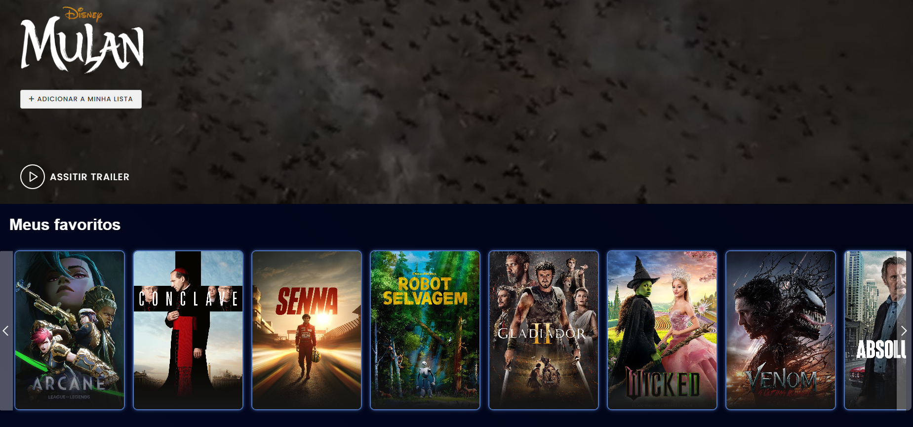

## 6. Interface do sistema

## 6.1. Tela principal do sistema

A tela principal do sistema é projetada para ser intuitiva e visualmente agradável, facilitando o acesso às principais funcionalidades. Ela está dividida em três áreas principais: header, conteúdo principal e footer.

Header
O cabeçalho do sistema é fixo e apresenta os seguintes elementos:

Logo do site: Posicionada no canto superior esquerdo.

Navegação principal:

  - Início: Link para a página inicial.
  
  - Séries: Direciona à página com lista de séries e um mecanismo de pesquisa dedicado.
  
  - Filmes: Direciona à página com lista de filmes e um mecanismo de pesquisa dedicado.
  
  - Favoritos: Acesso direto à lista de favoritos do usuário, exibindo os títulos salvos.
  
Área do usuário:

Links para as páginas de login, cadastro e página do usuário, com opções para remoção de conta, sair da conta e acesso às listas de favoritos.

Barra de pesquisa: Ferramenta global de busca para filmes e séries.

Conteúdo principal

A área central da página inicial é composta por seções em formato de carrossel ou lista de cartões (cards), apresentando os seguintes conteúdos:

  - Favoritos: Exibe os títulos favoritados pelo usuário (se houver). Caso contrário, não exibirá essa lista.

  - Títulos Recomendados: Com base no histórico de favoritos e interações do usuário, sugere filmes e séries de interesse.

  - Tendências: Apresenta os títulos mais populares, agrupando filmes e séries que estão em alta.

  - Filmes Populares: Destaque exclusivo para os filmes mais populares no momento.

  - Séries Populares: Seção semelhante para séries, destacando os títulos mais assistidos.

Footer

O rodapé do sistema contém:

 - Logo do site: Reforçando a identidade visual.

 - CineScore 2024 - All rights reserved: Informando os direitos reservados à plataforma.

## 6.2. Telas do processo 1

Tela de Login

Essa tela é o ponto inicial para o acesso ao sistema, permitindo que o usuário autentique sua conta ou escolha outras opções de acesso.

Campos principais:

  - E-mail: Campo para inserir um endereço de e-mail válido.

  - Senha: Campo para digitar a senha correspondente à conta.

Funcionalidades:

  - Entrar: Valida as credenciais fornecidas e, caso corretas, direciona o usuário à página inicial.
  - Cadastrar-se: Redireciona para a tela de cadastro.

Tela de Cadastro

Esta tela é destinada à criação de novas contas, coletando informações essenciais sobre o usuário.

Campos principais:

  - Nome: Nome completo do usuário.
  - Data de nascimento: Verifica se a idade do usuário está dentro das restrições (máximo de 130 anos).
  - E-mail: Endereço eletrônico para login e comunicação com o sistema.
  - Senha e Confirmar senha: Campos que garantem a segurança da conta e verificam a correspondência entre as senhas.
    
Funcionalidades:

  - Cadastrar: Finaliza o processo de cadastro e direciona o usuário para a tela de login.

Configurar Conta

A tela de configuração permite que usuários autenticados gerenciem suas informações.

Campos principais:

  - Nome: Permite atualizar o nome de exibição do usuário.
  - Senha: Permite atualizar a senha do usuário.

Funcionalidades:

  - Salvar: Confirma as alterações realizadas nos dados pessoais.
  - Remover conta: Permite excluir permanentemente a conta.
  - Meus favoritos: Redireciona para a tela que organiza os títulos favoritados pelo usuário.
    

## 6.3. Telas do processo 2

Visualizar Listas de Filmes e Séries

A tela inicial de visualização das listas de filmes e séries apresenta os títulos disponíveis com uma imagem de cartaz. O usuário pode clicar para visualizar mais detalhes de qualquer título.

Campos principais:

  - Imagem do cartaz: Exibe a capa do filme ou série.
    
Comandos disponíveis:

  - Visualizar: Redireciona para a tela de Detalhes do Título, onde o usuário pode obter mais informações sobre o conteúdo.

Visualizar Detalhes do Título

Ao selecionar um título, o usuário é direcionado para a tela de detalhes, onde pode ver informações completas sobre o filme ou série, bem como interagir com a plataforma.

Campos principais:

  - Nome: Exibe o nome do título (máximo de 100 caracteres).
  - Idiomas: Exibe os idiomas disponíveis (máximo de 100 caracteres).
  - Diretor: Exibe o nome do diretor (máximo de 100 caracteres).
  - Duração do Filme (minutos): Exibe a duração do filme (campo opcional).
  - Gênero: Exibe a categoria do título (pode selecionar múltiplos gêneros).
  - Imagem do Cartaz: Exibe a capa do título (formato JPEG, PNG).
  - Data de Lançamento: Exibe a data de lançamento do título.
  - Sinopse: Exibe a descrição do conteúdo (máximo de 1000 caracteres).
  - Comentário: Área onde o usuário pode escrever até 2000 caracteres sobre o título.
    
Comandos disponíveis:

  - Adicionar a minha lista: Adiciona o título à lista de favoritos.
  - Remover da minha lista: Remove o título à lista de favoritos.
  - Comentar: Permite ao usuário salvar seu comentário sobre o título.
  - Like: Permite avaliar o título, com opção de "like".
  - Deslike: Permite avaliar o título, com opção de "deslike".
  - Fechar: Fecha a tela de detalhes do título.

Visualizar Lista de Favoritos

Esta tela exibe todos os filmes e séries que foram adicionados à lista de favoritos do usuário. O título aparece com sua imagem de cartaz, e o usuário pode clicar sobre ele para visualizar mais detalhes.

Campos principais:

  - Imagem do Cartaz: Exibe a imagem de cada título na lista de favoritos.
    
Comandos disponíveis:

  - Visualizar: Ao clicar em um título, o usuário é redirecionado para a tela de Detalhes do Título.

## 6.4. Telas do processo 3

Visualizar Lista de Filmes e Séries

Exibe uma lista de filmes e séries com suas imagens de cartaz, com a possibilidade de o usuário clicar em um título para visualizar os detalhes. A lista é baseada em sugestões personalizadas para o usuário, sendo os itens apresentados com a imagem e informações essenciais.

Campos principais:

  - Imagem do Cartaz: Exibição da capa do título (formatos JPEG ou PNG).
    
Comandos disponíveis:

  - Visualizar: Ao clicar no título, o usuário é redirecionado para a tela de Detalhes do Título.

Visualizar Detalhes do Título

Esta tela fornece informações detalhadas sobre um título, incluindo nome, idioma, diretor, duração, gênero, sinopse, e mais. O usuário pode interagir com essas informações e gerenciar seu relacionamento com o título.

Campos principais:

  - Nome: Nome do título (máximo de 100 caracteres).
  - Idiomas: Idiomas disponíveis (máximo de 100 caracteres).
  - Diretor: Nome do diretor (máximo de 100 caracteres).
  - Duração do Filme: Duração do filme em minutos (opcional).
  - Gênero: Gênero(s) do título (obrigatório, seleção múltipla).
  - Imagem do Cartaz: Exibição da imagem do cartaz (formatos JPEG ou PNG).
  - Data de Lançamento: Data de lançamento (opcional, formato aaaa/mm/dd).
  - Sinopse: Descrição do conteúdo (máximo de 1000 caracteres).
  - Comentário: Área de texto para o usuário adicionar um comentário (máximo de 2000 caracteres).
  - Feedback de Like: Opção de selecionar "like" ou "deslike" para o título (sem restrição).
    
Comandos disponíveis:

  - Adicionar a minha lista: Adiciona o título à lista de favoritos.
  - Remover da minha lista: Remove o título à lista de favoritos.
  - Comentar: Permite ao usuário salvar seu comentário sobre o título.
  - Like: Permite avaliar o título, com opção de "like".
  - Deslike: Permite avaliar o título, com opção de "deslike".
  - Fechar: Fecha a tela de detalhes do título.

Visualizar Lista de Favoritos

Esta tela exibe todos os filmes e séries que foram adicionados à lista de favoritos do usuário. O título aparece com sua imagem de cartaz, e o usuário pode clicar sobre ele para visualizar mais detalhes.

Campos principais:

  - Imagem do Cartaz: Exibe a imagem de cada título na lista de favoritos.
    
Comandos disponíveis:

  - Visualizar: Ao clicar em um título, o usuário é redirecionado para a tela de Detalhes do Título.

Visualizar Recomendações

Apresenta uma lista de filmes e séries recomendados, que o usuário pode explorar. O usuário pode clicar sobre os títulos para ver detalhes e interagir com os mesmos, como adicionar à lista de favoritos ou avaliar o título.

Campos principais:

  - Imagem do Cartaz: Exibição das imagens de cartaz dos títulos recomendados.
    
Comandos disponíveis:

  - Visualizar: Ao clicar no título, o usuário será direcionado para a tela de Detalhes do Título, onde poderá ver mais informações e interagir com o conteúdo.

## 6.5. Telas do processo 4

Visualizar Lista de Filmes e Séries

A tela exibe uma lista de filmes e séries com a imagem do cartaz. O usuário pode clicar em qualquer título para visualizar mais informações e interagir com ele.

Campos principais:

  - Imagem do Cartaz: Exibe a imagem do cartaz do título (formatos JPEG ou PNG).
    
Comandos disponíveis:

  - Visualizar: Ao clicar no título, o usuário é redirecionado para a tela de Visualizar Detalhes do Título.

Visualizar Detalhes de um Título

Após clicar em um título da lista, o usuário é levado para uma tela com informações detalhadas sobre o filme ou série, onde pode deixar comentários, curtir ou descurtir, adicionar ou remover o título da lista de favoritos, e ver mais detalhes sobre o título.

Campos principais:

  - Nome: Nome do título (obrigatório, máximo de 100 caracteres).
  - Idiomas: Idiomas disponíveis do título (obrigatório, máximo de 100 caracteres).
  - Diretor: Nome do diretor (obrigatório, máximo de 100 caracteres).
  - Duração do Filme: Duração do filme (opcional, número positivo).
  - Gênero: Gênero(s) do título (obrigatório, seleção múltipla).
  - Imagem do Cartaz: Exibição da imagem do cartaz do título (opcional, formatos JPEG ou PNG).
  - Data de Lançamento: Data de lançamento (opcional, formato aaaa/mm/dd).
  - Sinopse: Descrição do conteúdo do título (obrigatório, máximo de 1000 caracteres).
  - Comentário: Área de texto onde o usuário pode adicionar um comentário (máximo de 2000 caracteres).
  - Feedback de Like: Opção de selecionar "like" ou "deslike" para o título (sem restrição).
    
Comandos disponíveis:

  - Adicionar a minha lista: Adiciona o título à lista de favoritos.
  - Remover da minha lista: Remove o título à lista de favoritos.
  - Comentar: Permite ao usuário salvar seu comentário sobre o título.
  - Like: Permite avaliar o título, com opção de "like".
  - Deslike: Permite avaliar o título, com opção de "deslike".
  - Fechar: Fecha a tela de detalhes do título.

Comentar

O usuário pode adicionar um comentário sobre o título, expressando sua opinião ou feedback pessoal sobre o filme ou série.

Campos principais:

  - Comentário: Área de texto onde o usuário pode escrever até 2000 caracteres.
    
Comandos disponíveis:

  - Comentar: O comentário é salvo ao ser enviado.

Like ou Deslike

O usuário pode avaliar o título com um "like" ou "deslike", usando a funcionalidade de feedback de like. O "like" é dado por um emoji de like, permitindo ao usuário demonstrar sua apreciação ou não pelo título.

Campos principais:

  - Feedback de Like / Deslike: Seleção única (like ou deslike).
    
Comandos disponíveis:

  - Emoji de Like / Deslike: O usuário pode dar um "like" ou um "deslike" ao título, salvando sua avaliação.

