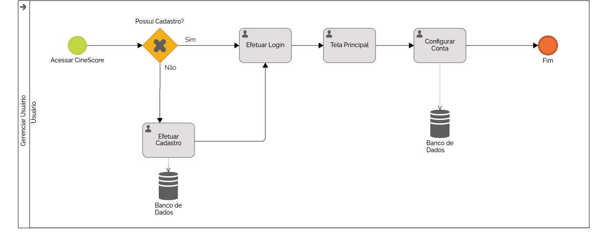

### 3.3.1 Processo 1 – Gerenciar usuários

#### 3.3.1.1 Oportunidades de melhorias:
- **Preferências:** Obter as preferências dos usuários assim que se cadastram, assim o sistema pode consumir os dados e oferecer recomendações personalizadas.

#### 3.3.1.2 Modelo do processo:

# Detalhamento das atividades

## **Efetuar login**

| **Campo**           | **Tipo**                           | **Restrições**                                  | **Valor default**     |
| ---                 | ---                                | ---                                             | ---                   |
| usuario_email       | Caixa de texto                     | Formato de email, limite de 80 caracteres       |                       |
| usuario_senha       | Caixa de Texto                     | Mínimo de 8 caracteres, limite de 40 caracteres |                       |

| **Comandos**        |  **Destino**                       | **Tipo**          |
| ---                 | ---                                | ---               |
| Entrar              | Verificar autenticidade dos dados  | Default           |
| Cadastrar-se        | Tela de cadastro                   | Link              |

## **Efetuar cadastro**

| **Campo**               | **Tipo**                           | **Restrições**                                    | **Valor default**     |
| ---                     | ---                                | ---                                               | ---                   |
| usuario_nome            | Caixa de texto                     | Limite de 80 caracteres                           |                       |
| usuario_data_nascimento | Data                               | A idade da pessoa não pode ser maior que 130 anos |                       |
| usuario_email           | Caixa de texto                     | Formato de email, limite de 80 caracteres         |                       |
| usuario_senha           | Caixa de Texto                     | Mínimo de 8 caracteres, limite de 40 caracteres   |                       |
| confirmar senha         | Caixa de Texto                     | Mínimo de 8 caracteres, limite de 40 caracteres   |                       |

| **Comandos**        |  **Destino**                                         | **Tipo**          |
| ---                 | ---                                                  | ---               |
| Cadastrar           | Tela de preenchimento do formulário de preferências  | Link              |
| Entrar              | Tela de login                                        | Link              |

## **Configurar conta**

| **Campo**                            | **Tipo**         | **Restrições**                                  | **Valor default**        |
| ---                                  | ---              | ---                                             | ---                      |
| usuario_nome                         | Caixa de texto   |  Limite de 80 caracteres                        |                          |
| usuario_senha           | Caixa de Texto                     | Mínimo de 8 caracteres, limite de 40 caracteres   |                       |

| **Comandos**             |  **Destino**                           | **Tipo**        |
| ---                      | ---                                    | ---             |
| Salvar                   | Tela de atualização de dados           | Link            | 
| Remover                  | Excluir a conta                        | Link            |
| Informações de acesso    | Tela usuario informação de acesso      | Link            |
| Meus favoritos           | Tela usuario favoritos                 | Link            |
| Cancelar                 | Tela de home screen                    | Link            |

