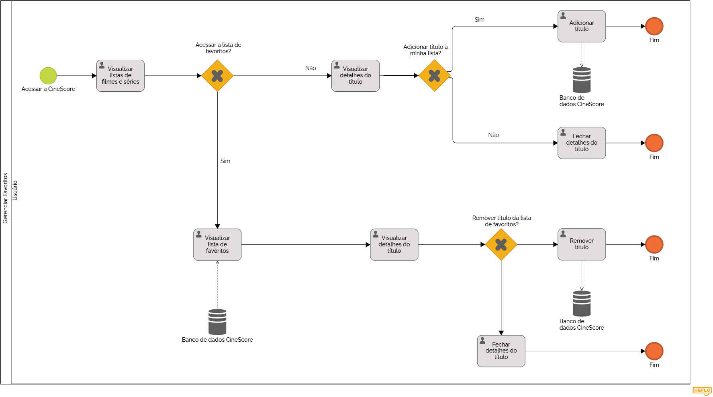

### 3.3.2 Processo 2 – Gerenciar favoritos

#### 3.3.2.1 Oportunidades de melhorias:

#### Gerenciar favoritos

- **Situação Atual:** O gerenciamento de favoritos é realizado exclusivamente a partir de dados fornecidos pela API, limitando a interação do usuário ao adicionar ou remover títulos já disponíveis.
- **Melhoria:** Aperfeiçoar a funcionalidade de gerenciamento de favoritos, mantendo a consistência com os dados da API, mas oferecendo mais opções de organização e interação com as listas personalizadas.
- **Benefício:** Permite que os usuários tenham maior controle sobre a organização de suas listas, sem fugir dos dados oficiais da API.

#### 3.3.2.2 Modelo do processo:

# Detalhamento das atividades

## **Visualizar Listas de Filmes e Séries**

| **Campo**                    | **Tipo**         | **Restrições**                                        | **Valor default** |
| ---                          | ---              | ---                                                   | ---               |
| titulo_imagem_cartaz         | Imagem           | formatos: JPEG, PNG:(Opcional)                        | (valor do título) |

| **Comandos**                 |  **Destino**                                                             | **Tipo**          |
| ---                          | ---                                                                      | ---               |
| Visualizar                   | Exibe detalhes do título	                                                | default           |

## **Visualizar Lista de Favoritos**

| **Campo**                    | **Tipo**         | **Restrições**                                        | **Valor default** |
| ---                          | ---              | ---                                                   | ---               |
| titulo_imagem_cartaz         | Imagem           | formatos: JPEG, PNG:(Opcional)                        | (valor do título) |

| **Comandos**         |  **Destino**                                     | **Tipo**          |
| ---                  | ---                                              | ---               |
| Visualizar           | Exibe detalhes do título	                        | default           |

## **Visualizar Detalhes do Título**

| **Campo**                    | **Tipo**         | **Restrições**                                        | **Valor default** |
| ---                          | ---              | ---                                                   | ---               |
| titulo_nome                  | Caixa de Texto   | Máximo de 100 caracteres:(Obrigatório)                | (valor do título) |
| titulo_idiomas               | Caixa de Texto   | Máximo de 100 caracteres:(Obrigatório)                | (valor do título) |
| titulo_diretor               | Caixa de Texto   | Máximo de 100 caracteres:(Obrigatório)                | (valor do título) |
| titulo_filme_duracao_minutos | Número           | Número Positivo:(Opcional)                            | (valor do título) |
| titulo_genero                | Seleção Múltipla | Deve ser selecionada ao menos um gênero:(Obrigatório) | (valor do título) |
| titulo_imagem_cartaz         | Imagem           | formatos: JPEG, PNG:(Opcional)                        | (valor do título) |
| titulo_data_lançamento       | Data             | Data no formato aaaa/mm/dd:(Opcional)                 | (valor do título) |
| titulo_sinopse               | Caixa de Texto   | Máximo de 1000 caracteres:(Obrigatório)               | (valor do título) |
| feedback_comentario          | Área de texto    | até 2000 caracteres                                   | vazio             |
| feedback_like                | Seleção única    | Sem restrição                                         | default           |

| **Comandos**               |  **Destino**                                     | **Tipo**          |
| ---                        | ---                                              | ---               |
| Adicionar a minha lista    | Adiciona a minha lista                           | add               |
| Remover da minha lista     | Remove da minha lista                            | del               |
| Comentar                   | Salvar comentário                                | default           |
| Like                       | Avalia                                           | radio             |
| Deslike                    | Avalia                                           | radio             |
| Fechar                     | Fecha o popup do título	                        | cancel            |

