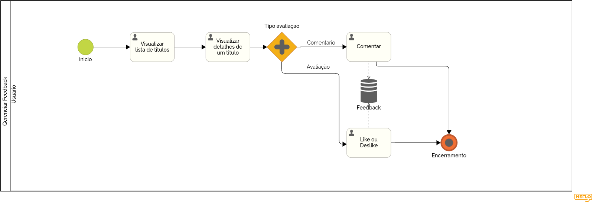

### 3.3.4 Processo 4 – Gerenciar feedback

#### 3.3.4.1 Oportunidades de melhorias:

#### Gerenciar Feedback

- **Situação Atual:** Registro de feedbacks de forma desorganizada ou até mesmo inexistente. 
- **Melhoria:** Implementar um algoritmo para calcular a média de todas as avaliações dos usuários e um registro de mensagens. 
- **Benefício:** Auxilia na escolha do filme e também gera uma confiança maior ao ler os feedbacks de outros usuários.

#### 3.3.4.2 Modelo do processo:

# Detalhamento das atividades

## **Visualizar Lista de Filmes e Séries**

| **Campo**                    | **Tipo**         | **Restrições**                                        | **Valor default** |
| ---                          | ---              | ---                                                   | ---               |
| titulo_imagem_cartaz         | Imagem           | formatos: JPEG, PNG:(Opcional)                        | (valor do título) |

| **Comandos**         |  **Destino**                                     | **Tipo**          |
| ---                  | ---                                              | ---               |
| Visualizar           | Exibe detalhes do título	                        | default           |

## **Visualizar detalhes de um título**

| **Campo**           | **Tipo**         | **Restrições**         | **Valor default** |
| ---                 | ---              | ---                    | ---               |
| titulo_nome                  | Caixa de Texto   | Máximo de 100 caracteres:(Obrigatório)                | (valor do título) |
| titulo_idiomas               | Caixa de Texto   | Máximo de 100 caracteres:(Obrigatório)                | (valor do título) |
| titulo_diretor               | Caixa de Texto   | Máximo de 100 caracteres:(Obrigatório)                | (valor do título) |
| titulo_filme_duracao_minutos | Número           | Número Positivo:(Opcional)                            | (valor do título) |
| titulo_genero                | Seleção Múltipla | Deve ser selecionada ao menos um gênero:(Obrigatório) | (valor do título) |
| titulo_imagem_cartaz         | Imagem           | formatos: JPEG, PNG:(Opcional)                        | (valor do título) |
| titulo_data_lançamento        | Data             | Data no formato aaaa/mm/dd:(Opcional)                 | (valor do título) |
| titulo_sinopse               | Caixa de Texto   | Máximo de 1000 caracteres:(Obrigatório)               | (valor do título) |
| feedback_comentario | Área de texto    | até 2000 caracteres    | vazio             |
| feedback_like       | Seleção única    | Sem restrição          | default           |

| **Comandos**         |  **Destino**                   | **Tipo**          |
| ---                  | ---                            | ---               |
| Adicionar a minha lista    | Adiciona a minha lista                           | add               |
| Adicionar a minha lista    | Remove da minha lista                            | del               |
| Comentar             | Salvar comentário              | default           |

## **Comentar**

| **Campo**           | **Tipo**         | **Restrições**         | **Valor default** |
| ---                 | ---              | ---                    | ---               |
| feedback_comentario | Área de texto    | até 2000 caracteres    | vazio             |

| **Comandos**         |  **Destino**                   | **Tipo**          |
| ---                  | ---                            | ---               |
| Comentar             | Salvar comentário              | default           |

## **Like ou dislike**

| **Campo**           | **Tipo**         | **Restrições**         | **Valor default** |
| ---                 | ---              | ---                    | ---               |
| feedback_like       | Seleção única    | Sem restrição          | default           |

| **Comandos**         |  **Destino**                   | **Tipo**          |
| ---                  | ---                            | ---               |
| Emoji de like        | Salvar like                    | default           |
